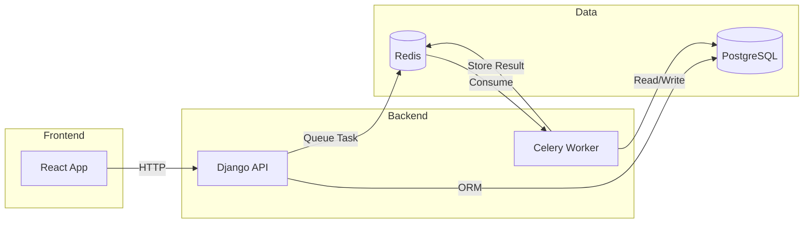
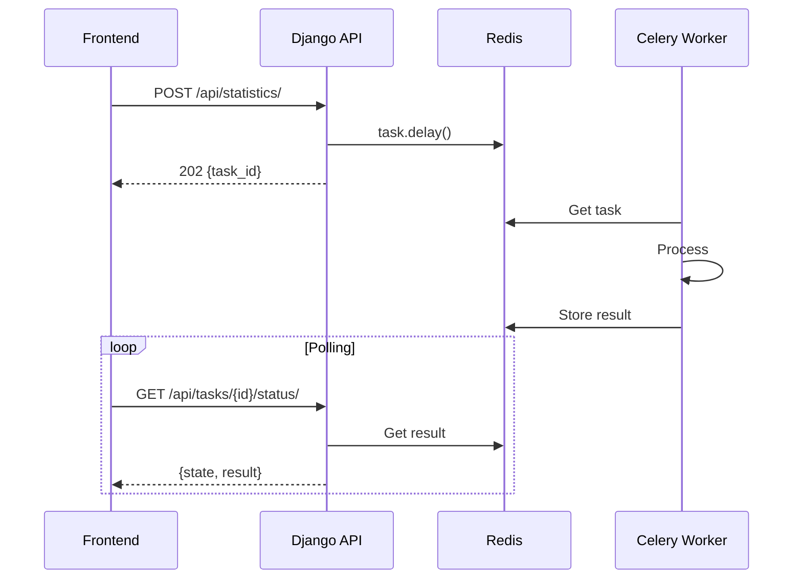

# Example CRUD API

Full-stack application with Django REST Framework backend and React frontend.

## Tech Stack

**Backend:** Python, Django 4.2, Django REST Framework, PostgreSQL, Celery, Redis

**Frontend:** React 18, Bootstrap 5

## Architecture



### Async Task Flow



## Project Structure

```
example_crud_api/
├── backend/
│   ├── app/
│   │   ├── models.py
│   │   ├── serializers.py
│   │   ├── views.py
│   │   ├── urls.py
│   │   └── tasks.py
│   ├── config/
│   │   ├── settings.py
│   │   ├── urls.py
│   │   └── celery.py
│   ├── docker-compose.yml
│   ├── Dockerfile
│   ├── requirements.txt
│   └── setup.sh
├── frontend/
│   ├── src/
│   │   ├── api.js
│   │   ├── App.js
│   │   └── components/
│   │       ├── DateFilter.js
│   │       ├── LongTaskPanel.js
│   │       ├── PersonForm.js
│   │       ├── PersonList.js
│   │       └── StatisticsPanel.js
│   ├── docker-compose.yml
│   ├── Dockerfile
│   └── package.json
└── documentation/
```

## Quick Start

### Backend

```bash
cd backend
chmod +x setup.sh
./setup.sh
```

### Frontend

```bash
cd frontend
npm install
npm start
```

## API Endpoints

| Endpoint | Description |
|----------|-------------|
| `/api/persons/` | Person CRUD |
| `/api/long-task/` | Start async task |
| `/api/long-task/{id}/` | Check task status |
| `/api/statistics/` | Calculate statistics |
| `/api/docs/` | Swagger documentation |
| `/admin/` | Django admin |

## Features

- Person CRUD with pagination
- Date filtering (created/modified)
- Long-running async tasks with Celery
- Statistics calculation (mean, std deviation)
- Task status polling

## Configuration

Update `.env` files in backend and frontend directories to match your setup.

Default ports:
- Backend: `8001`
- Frontend: `3000`
- PostgreSQL: `5432`
- Redis: `6380`

